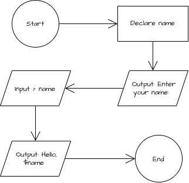

# Debugging Warm-Up 01

This program takes in user input, then prints a greeting to the user's entered name.

## Compiling and Run

```
g++ src/main.cpp -o main
./main
```

## Pseudocode

```
FUNCTION main()
    DECLARE name : STRING

    OUTPUT Enter your name:
    INPUT name

    OUTPUT "Hello, ", name
ENDFUNCTION
```

## Flow Chart


